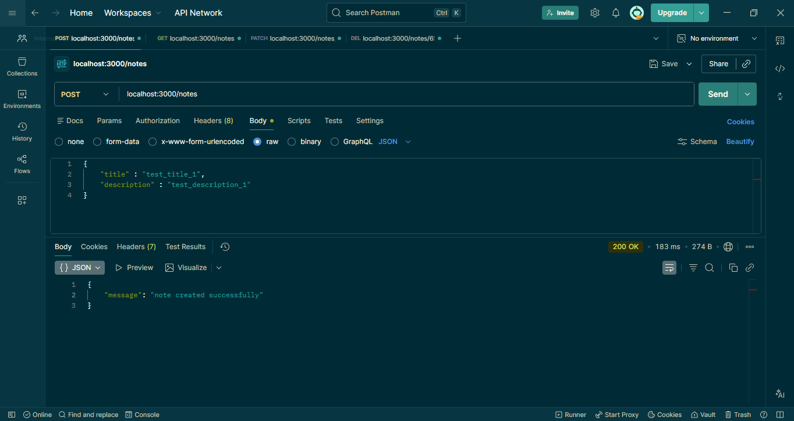
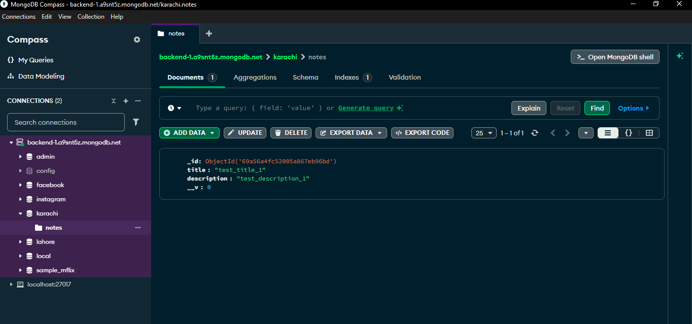
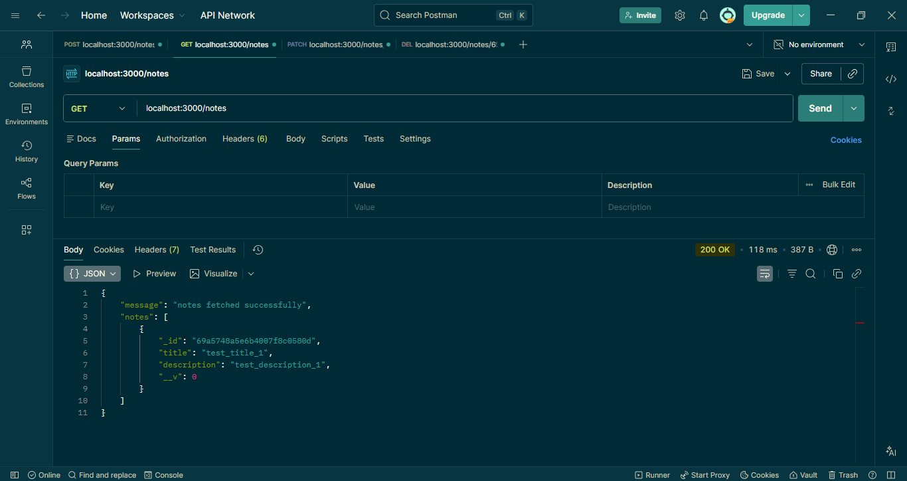
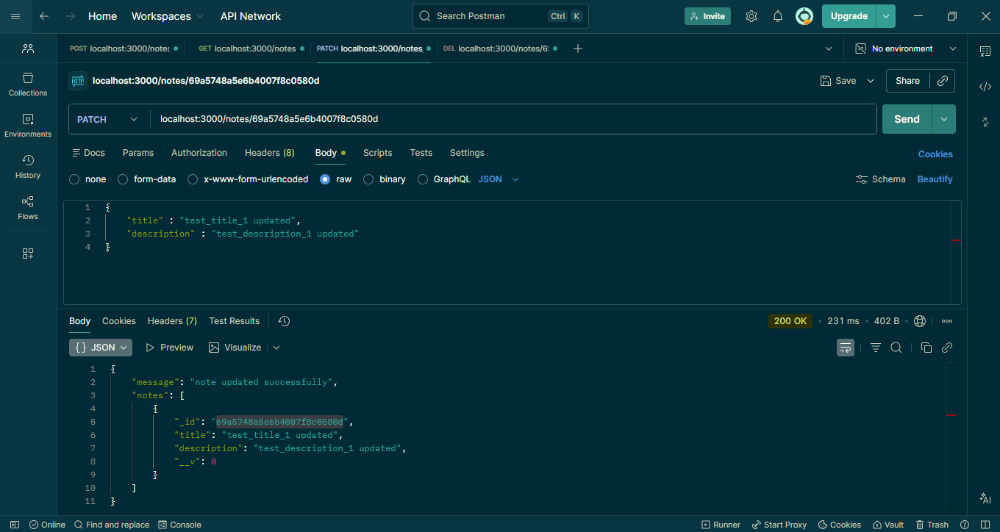
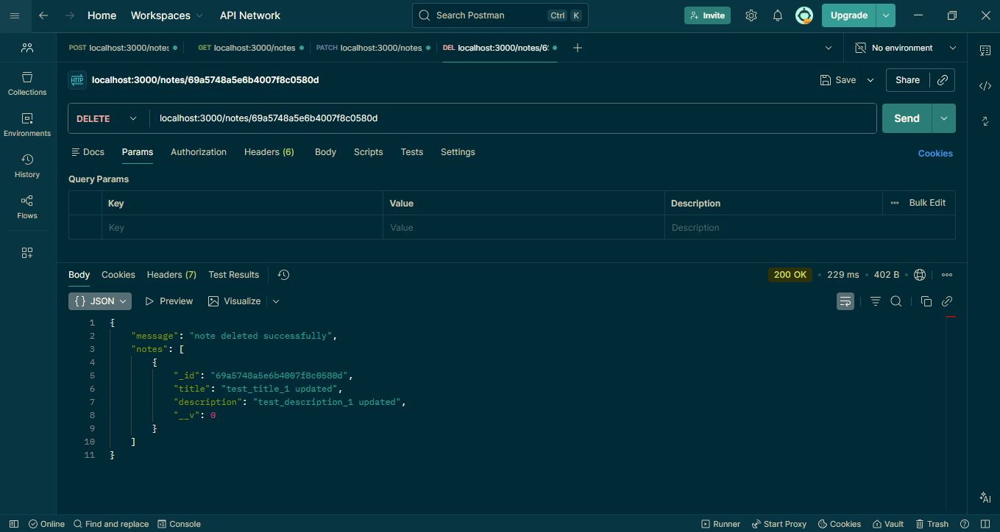

# 📝 Notes App - REST API

A simple and scalable Notes Application backend built using **Node.js, Express, and MongoDB**.  

This small project implements full **CRUD (Create, Read, Update, Delete)** functionality using REST API architecture and is tested using Postman.

---

## 🚀 Features

- Create a new note
- Get all notes
- Update note
- Delete note
- MongoDB Atlas cloud database
- RESTful API structure
- Postman tested endpoints

---

## 🛠️ Tech Stack

- Node.js
- Express.js
- MongoDB
- MongoDB Atlas (Cloud Database)
- Postman (API Testing)

---

## 📸 API Testing Screenshots

### 🔹 Create Note

### 🔹 Note Created (Mongodb)

### 🔹 Get All Notes

### 🔹 Update Note

### 🔹 Delete Note

---
